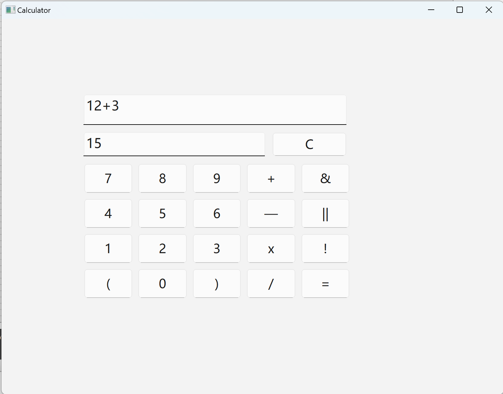

# Calculator

A calculator for basic calculation including plus,subtract,multiply,divide and brackets. Written in C++, and use Qt as user interface.

## How to use this Calculator

### Way 1: Install QT, build and run this project.